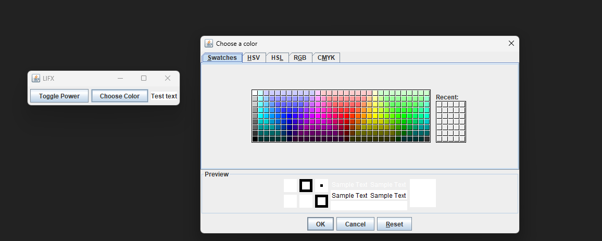

  

  <h3 align="center">LIFXProject</h3>

  

    Little Java GUI program designed to interface with LIFX lightbulbs over HTTP from a desktop computer.
  

## About

I originally wrote this program to be able to convienently interact with an LIFX lightbulb that I put in my lamp by my bedside. LIFX has a mobile app, which is convienent but I have some gripes with. As of the creation of this program, 
LIFX does not have a desktop app. There are alternatives out there, however I wanted to develop my own solution as a learning experience and to talor it to my specific wants over time.

## Instructions

In order to use this program, you will need to build the jar and place a .txt file named "token.txt" in the same directory as your jar. The token.txt file contains your API key, pretty self explanatory.

# Usage

 
Toggle Power - if bulb is on, turn off and vice versa
 

 
Choose Color - set lightbulb to color chosen from color picker
 
